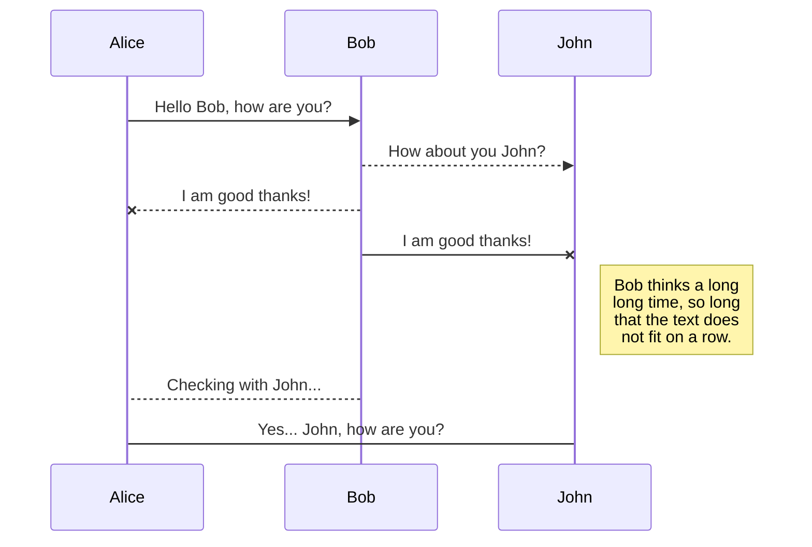
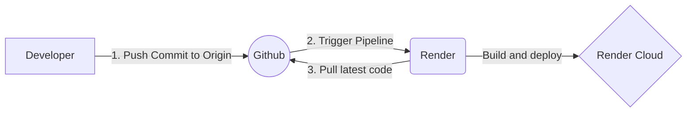

- [My List Feature](#my-list-feature)
  - [Live service Details](#live-service-details)
  - [Setup Instructions](#setup-instructions)
  - [Run Test Cases](#run-test-cases)
  - [API Desgin](#api-desgin)
    - [Approach 1](#approach-1)
    - [Approach 2](#approach-2)
  - [DB Models](#db-models)
    - [Approach 1](#approach-1-1)
    - [Approach 2](#approach-2-1)
      - [Design Decision](#design-decision)
    - [Sequence Diagram](#sequence-diagram)
  - [CI/CD](#cicd)
  - [HighLights](#highlights)
  - [What can be improved?](#what-can-be-improved)

---

# My List Feature

## Live service Details

`HOST`: https://stage-expressapp.onrender.com

**API endpoints**
* POST https://stage-expressapp.onrender.com/api/mylist/
```json
{
    "userId": "51cface4-5a2c-4eaf-a4df-4c4b736bcf9d",
    "itemId": "51cface4-5a2c-4eaf-a4df-4c4b736bcf3d",
    "itemType": "Movie"
}
```
* GET https://stage-expressapp.onrender.com/api/mylist?userId=51cface4-5a2c-4eaf-a4df-4c4b736bcf9d&page=1&limit=10
* DELETE https://stage-expressapp.onrender.com/api/mylist/
```json
{
  "userId": "51cface4-5a2c-4eaf-a4df-4c4b736bcf9d",
    "itemId": "51cface4-5a2c-4eaf-a4df-4c4b736bcf4d"
}
```

## Setup Instructions

| Action                                               | Command                                                         |
| :--------------------------------------------------- | :-------------------------------------------------------------- |
| 💻 Install dependencies                             | `npm install`                                                   |
| ⚙️ Setup environment variables. Create a .env file | `MONGODB_URI=mongodb://localhost:27017/mylist` <br> `PORT=3000` |
| ⚡ Run Script to initialize DB                       | `npx ts-node initializeDBScript.ts`                             |
| 🚀 Run the application                              | `npm run dev-start`                                             |

---

## Run Test Cases

> npm test

---

## API Desgin


### Approach 1
 
| HTTP Method    | API Endpoint  | Request Body                                          | Query Parameters |
| :------------- | :------------ | :---------------------------------------------------- | :--------------- |
| :sparkle: GET  | `/api/mylist` | -                                                     | page=1&limit=10  |
| :pencil2: POST | `/api/mylist` | userId:"UUID",itemId:"UUID", itemType:"Movie/ TvSHow" | -                |
| :x: DELETE     | `/api/mylist` | userId:"UUID",itemId:"UUID"                           | -                |

### Approach 2

| HTTP Method    | API Endpoint                         | Request Body     | Query Parameters |
| :------------- | :----------------------------------- | :--------------- | :--------------- |
| :sparkle: GET  | `/api/user/:user_id/mylist`          | -                | page=1&limit=10  |
| :pencil2: POST | `/api/user/:user_id/mylist`          | itemId, itemType | -                |
| :x: DELETE     | `/api/user/:user_id/mylist/:item_id` | -                | -                |

--- 
## DB Models

### Approach 1

Put myList field inside User Schema
```json
User: {
    id: string,
    username: string,
    ...
    ...
    myList: {
        itemId: string,
        itemType: string,
        dateAddedOn: Date,
    }
}
```

✅ `PROS`:
✔️ Faster: No need to make extra call to fetch myList data.
✔️ Mylist information can be fetched initially from /api/me and save in local cache
✔️ Scalable: Any additional metadata can be added


🚨 `CONS`:
❗Tight Coupling: Dependency on User Schema
❗Not preferable for microservice arcitechure
❗UserService and MyList Service can not scale independently


### Approach 2

Consider myList as a separate collection

**== 2.1 ==**
```json
User: {
    id: string,
    username: string,
    ...
    ...
}
    
myList: {
    userId: string,
    itemId: string,
    itemType: string,
    dateAddedOn: Date,
}
```
✅ `PROS`:
✔️ ListItems can be handled separately for all users
✔️ Addition and removal of new record is faster
✔️ Mongo Can filter or sort on the `dateAddedOn` field easily

🚨 `CONS`:
❗ Need to touch multiple documents to fetch myList of single user.
❗ Slower GET request

**== 2.2 ==**
```json
User: {
    id: string,
    username: string,
    ...
    ...
}

myList: {
    userId: string,
    wishList: [{
        itemId: string,
        itemType: string,
        dateAddedOn: Date,
    }]
}
```

✅ `PROS`:
✔️ List of items for a single user can be fetched from a single document
✔️ Faster GET request
✔️ FutureProof / Scalable: Can add user's metadata to this schema

🚨 `CONS`:
❗ Nested Array of objects difficult to handle(filter / sort) in Mongo.
❗ Removal of item from list is slower

#### Design Decision

**Assumption**: We have monolithic service

* Choosing first approach considering
  * Easier to implement
  * Low Maintenance
  * High performance (GET/POST)

---

### Sequence Diagram



---

## CI/CD

* **For CI/CD**: `Render Pipeline`
* **Deployed On**: `Render Cloud`



## HighLights

- [x] MongoDB Integration
- [x] Script to initialize database
- [x] Write Unit test cases
- [x] Validate request body: Using Joi
- [x] Generate random values: using Faker
- [x] CI/CD
- [x] Deploy on any cloud service

## What can be improved?

1. Check for test coverage results in CI/CD pipeline
2. Setup Pre-Commit hooks to ensure
   1. Consistent commit messages
   2. Language standards: linting
3. Map Foreign Key in MyList
4. Make file to setup repository with single command
